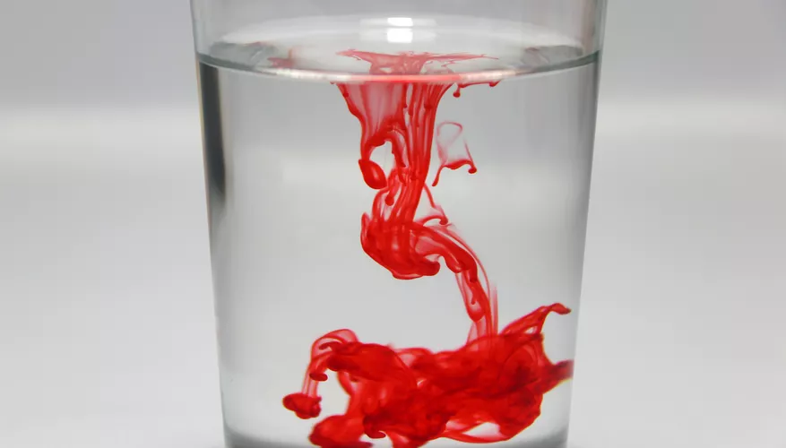
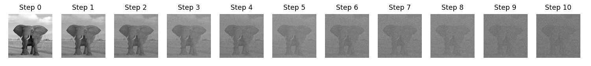
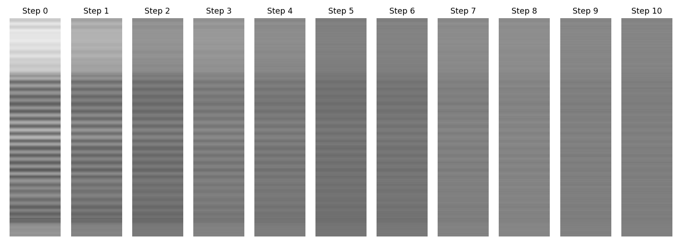

# Introduction to Diffusion Models: Visual Information Reconstruction in Neural Networks

## Introduction

This paper introduces the application of Latent Diffusion Models (LDM) in reconstructing high-resolution images from brain activity, focusing particularly on the use of the U-Net architecture within these models. We discuss the general mechanism of LDMs, their integration in Code, and specific use cases in visual information processing. This discussion is contextualized within recent research using LDM to reproduce visual perceptions based on brain activity data.

## Stable diffuision
Think of stable diffusion like a sophisticated game of telephone, but with math. The model uses a stochastic process (fancy term for randomness), where each state depends only on the previous one, forming what's known as a Markov chain. This iterative method transitions from one distribution to another, 

The model employs a stochastic (fancy term for randomness), where each state depends only on the previous state. The method iteratively transitions from one distribution to another, an idea used in non-equilibrium thermodynamics, and so it's effectively tracing and reconstructing lost information.
much like how your coffee diffuses into water—starting with a Gaussian distribution and transforming it into a target distribution.

So, just like our ink in water, we first immerse the data into noise (the forward process or encoder) and then trace it back to the original information (the backward process or decoder).

## Forward process
During this process, Gaussian noise is progressively added to the data X over T steps, creating a sequence of increasingly noisy data representations {Xt}. This simulates a forward diffusion process where the data becomes more corrupted at each step. The result for each individual data point X can be seen in the image before where T=10 (normally T~=1000) However, this type of algorithm might struggle with high computational costs and inefficiencies when processing high-dimensional data, as these costs scale significantly with the data's dimensionality. A solution to this can be found in Latent Diffusion Models (LDM).

Check out the `forward_process.py` file for an example of the code in action.

Latent Diffusion Models (LDM) involve encoding an image into a latent space, applying noise to the latent representation over several steps (the forward diffusion process), and then attempting to reconstruct the image from the noisy latent representation (the reverse diffusion process).

Check out the `latent_forward_process.py` file for an example of the code in action.

* Step 0: The latent representation of the original image, which retains most of the information from the original image but in a compressed form.
* Step 1 to Step 10: Progressive addition of noise to the latent representation. As you move from Step 1 to Step 10, the latent representation becomes increasingly noisy, leading to a loss of the original information. By Step 10, the representation appears nearly homogeneous, indicating significant information loss.

## Backward Process

## Implementation of U-Net in LDM

The U-Net architecture plays a crucial role in the functionality of Latent Diffusion Models. Originally developed for biomedical image segmentation, U-Net has been adapted for the generative tasks of LDMs to enhance the quality and precision of the image generation process. Here, we provide TensorFlow code snippets to illustrate the implementation of U-Net within the LDM framework, emphasizing how this integration aids in detailed and accurate image reconstruction

